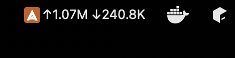
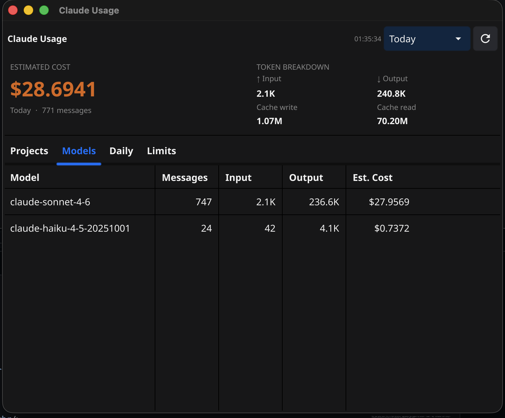
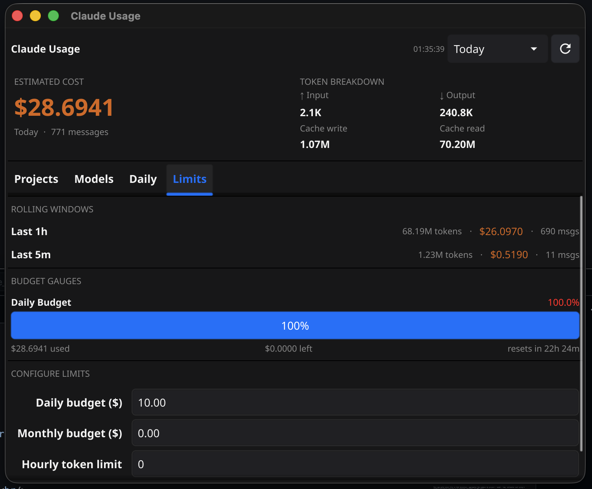

<div align="center">

# Claude Usage Tracker

**A lightweight, native system tray app that shows your Claude Code token usage and estimated spend — live, in your menu bar.**

[](https://go.dev)
[](https://fyne.io)
[](#requirements)
[](LICENSE)
[](#how-it-works)
[](https://github.com/bolacha/claude-tray-usage/actions/workflows/ci.yml)
[](https://github.com/bolacha/claude-tray-usage/releases/latest)

<br/>

<!-- Replace with your actual tray bar screenshot -->


*↑ Live token counts right in your menu bar — no setup, no API key, no cloud.*

</div>

---

## Why?

Claude Code is powerful — but it's easy to lose track of how much you're actually spending across projects. This app reads Claude's local session files directly and gives you a real-time cost dashboard without sending anything anywhere.

- Zero config to get started
- Reads only from `~/.claude/` — nothing leaves your machine
- Updates every 5 seconds
- Works on macOS, Linux, and Windows

---

## Screenshots

<div align="center">
<table>
  <tr>
    <td align="center">
      <br/>
      <sub><b>Main window — cost hero + token breakdown</b></sub>
    </td>
    <td align="center">
      <br/>
      <sub><b>Limits tab — rolling windows + budget gauges</b></sub>
    </td>
  </tr>
</table>

> **Add your own screenshots:** take a screenshot of the app and replace the placeholders in `docs/`.

</div>

---

## Features

| | |
|---|---|
| **Live menu bar** | Anthropic icon with `↑ tokens sent` and `↓ tokens received`, updating every 5 seconds |
| **Cost hero** | Large estimated spend for the selected period, front and centre |
| **Token breakdown** | Input · Output · Cache write · Cache read |
| **By Project** | All your Claude Code projects ranked by spend |
| **By Model** | Sonnet vs Haiku vs Opus usage split |
| **Daily history** | Per-day breakdown, newest first |
| **Budget gauges** | Progress bars for daily / monthly spend and hourly token rate with color-coded warnings |
| **Rolling windows** | Last 5 min and last 1 hour — useful for spotting rate-limit pressure |
| **Configurable limits** | Set your own daily / monthly / hourly caps via the in-app form |
| **Auto-refresh** | Watches your session files, no restart needed |

---

## How it works

Claude Code writes every conversation turn to JSONL files in `~/.claude/projects/`. Each assistant response includes a `usage` block:

```json
{
  "usage": {
    "input_tokens": 3,
    "cache_creation_input_tokens": 1034,
    "cache_read_input_tokens": 14571,
    "output_tokens": 11
  }
}
```

This app walks every file in that directory, aggregates the numbers by project / model / day, estimates cost using Anthropic's published pricing, and renders everything natively — no external services, no API calls.

---

## Cost estimation

Pricing defaults are based on **Claude Sonnet 4** rates (applied uniformly across all models as a conservative estimate):

| Token type   | Per 1M tokens |
|--------------|---------------|
| Input        | $3.00         |
| Output       | $15.00        |
| Cache write  | $3.75         |
| Cache read   | $0.30         |

> To update pricing, edit the constants at the top of [`stats/stats.go`](stats/stats.go).

---

## Requirements

| Platform | Requirement |
|----------|-------------|
| **macOS** | Go 1.21+ — nothing else needed |
| **Linux** | Go 1.21+ · `libgl1-mesa-dev` · `xorg-dev` |
| **Windows** | Go 1.21+ — nothing else needed |

**Linux one-liner:**
```bash
sudo apt-get install libgl1-mesa-dev xorg-dev
```

---

## Installation

### Download a pre-built binary (recommended)

Head to the [**latest release**](https://github.com/bolacha/claude-tray-usage/releases/latest) and grab the file for your platform:

| Platform | File |
|----------|------|
| macOS (Apple Silicon — M1/M2/M3/M4) | `claude-tray-macos-arm64.zip` |
| Linux x86_64 | `claude-tray-linux-amd64.tar.gz` |
| Linux arm64 | `claude-tray-linux-arm64.tar.gz` |
| Windows | `claude-tray-windows-amd64.zip` |

**macOS** — unzip, then allow the binary past Gatekeeper:
```bash
unzip claude-tray-macos-arm64.zip
xattr -cr claude-tray && ./claude-tray
```

**Linux:**
```bash
tar xzf claude-tray-linux-amd64.tar.gz && ./claude-tray
```

**Windows:** extract the zip and double-click `claude-tray.exe`.

---

### Build from source
```bash
git clone https://github.com/bolacha/claude-tray-usage
cd claude-tray-usage
go build -o claude-tray .
./claude-tray
```

### Homebrew (coming soon)
```bash
brew install claude-tray   # not yet published — PRs welcome!
```

---

## Auto-start on login

<details>
<summary><b>macOS — Launch Agent</b></summary>

```bash
cat > ~/Library/LaunchAgents/com.claude-tray.plist << EOF
<?xml version="1.0" encoding="UTF-8"?>
<!DOCTYPE plist PUBLIC "-//Apple//DTD PLIST 1.0//EN" "http://www.apple.com/DTDs/PropertyList-1.0.dtd">
<plist version="1.0">
<dict>
  <key>Label</key>        <string>com.claude-tray</string>
  <key>ProgramArguments</key>
  <array><string>/usr/local/bin/claude-tray</string></array>
  <key>RunAtLoad</key>    <true/>
  <key>KeepAlive</key>    <false/>
</dict>
</plist>
EOF

launchctl load ~/Library/LaunchAgents/com.claude-tray.plist
```

</details>

<details>
<summary><b>Linux — systemd user service</b></summary>

```bash
mkdir -p ~/.config/systemd/user
cat > ~/.config/systemd/user/claude-tray.service << EOF
[Unit]
Description=Claude Usage Tracker

[Service]
ExecStart=%h/.local/bin/claude-tray
Restart=on-failure

[Install]
WantedBy=default.target
EOF

systemctl --user enable --now claude-tray
```

</details>

---

## Configuration

Settings are stored at `~/.claude/tray-config.json` and can be edited directly or via the **Limits** tab inside the app:

```json
{
  "daily_budget_usd": 10.00,
  "monthly_budget_usd": 0,
  "hourly_token_limit": 0
}
```

Set any value to `0` to hide that gauge. Changes take effect on the next refresh.

---

## Project structure

```
claude-tray-usage/
├── main.go            — entry point, tray icon, refresh ticker
├── parser/
│   └── parser.go      — reads ~/.claude/projects/**/*.jsonl
├── stats/
│   └── stats.go       — aggregation, cost estimation, rolling windows
├── config/
│   └── config.go      — budget limits (~/.claude/tray-config.json)
└── ui/
    └── ui.go          — Fyne window, hero section, tables, limits tab
```

---

## Dependencies

| Package | Version | Purpose |
|---------|---------|---------|
| [fyne.io/fyne/v2](https://fyne.io/) | v2.7.3 | Cross-platform GUI + system tray |
| [fyne.io/systray](https://github.com/fyne-io/systray) | v1.12.0 | Menu bar title and tooltip text |

---

## Contributing

Contributions are welcome! Some ideas if you want to help:

- [ ] Per-model accurate pricing (Opus vs Sonnet vs Haiku differ significantly)
- [ ] Export usage data to CSV
- [ ] Homebrew formula
- [ ] Windows installer (NSIS / WiX)
- [ ] Dark/light mode adaptive tray icon

Open an issue or PR — and if this saves you from a surprise bill, consider leaving a ⭐

---

## License

[MIT](LICENSE) — free to use, modify, and distribute.

---

<div align="center">
  <sub>Built with Go + Fyne · Reads only local files · No telemetry</sub>
</div>
